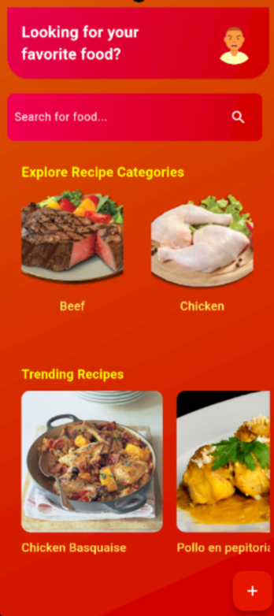
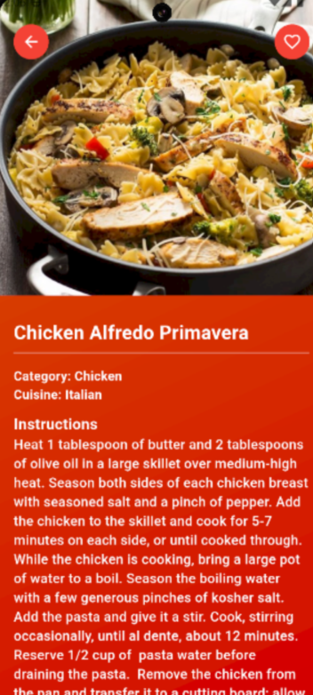
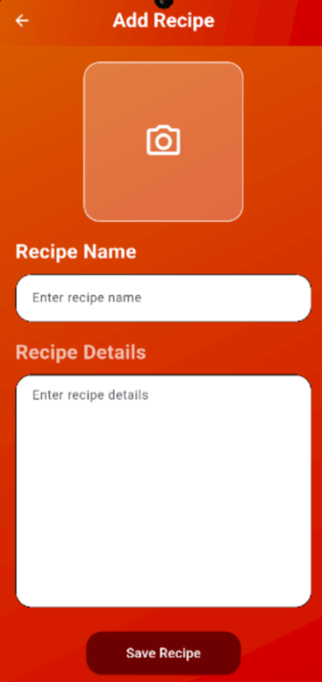
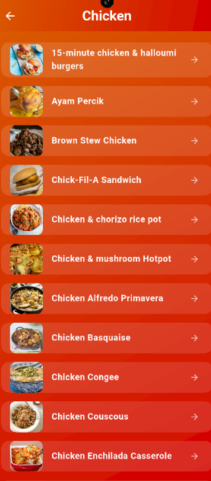
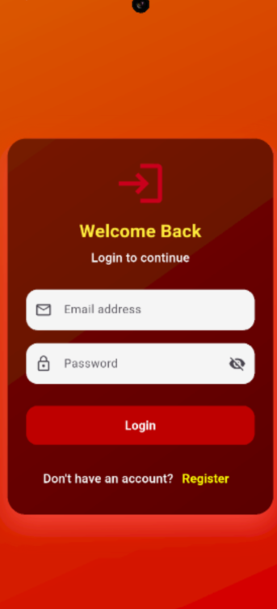

# Elavo

**Elavo** is a recipe project made using **Flutter** and **Supabase**. It allows users to explore, add, and manage recipes seamlessly with a modern mobile interface.
---

## Features
- Browse a variety of recipes from **TheMealDB API**.
- Add, edit, and delete your own recipes using **Supabase** for backend storage.
- Upload images for recipes using the device camera or gallery.
- Environment-based configuration using `.env` files.
- Modern, responsive UI with Flutter's Material Design.
---


## Screenshots

Here are some screenshots of the app:
## 📸 Screenshots

<table>
  <tr>
    <td align="center">
      <br>
      Splash Screen
    </td>
    <td align="center">
      <br>
      Home Screen
    </td>
    <td align="center">
      <br>
      Recipe Details
    </td>
  </tr>

  <tr>
    <td align="center">
      <br>
      Add Recipe
    </td>
    <td align="center">
      <br>
      My Recipe
    </td>
    <td align="center">
      <br>
      Search
    </td>
  </tr>

  <tr>
    <td align="center">
      <br>
      Category
    </td>
    <td align="center">
      <br>
      Login
    </td>
    <td align="center">
      <br>
      Register
    </td>
  </tr>

  <tr>
    <td align="center">
      <br>
      Profile
    </td>
  </tr>
</table>

---

## Getting Started

### Prerequisites

- [Flutter](https://flutter.dev/docs/get-started/install) >= 3.8.1
- Dart SDK >= 3.8.1
  
- Supabase account (for authenticating and managing recipe details)

### Installation

1. Clone the repository:

```bash
git clone https://github.com/yourusername/elavo.git
cd elavo
````

2. Install dependencies:

```bash
flutter pub get
```

3. Create a `.env` file in the root directory and add your environment variables:

```env
IMGBB_API_KEY=your_imgbb_api_key
SUPABASE_URL=your_supabase_url
SUPABASE_ANON_KEY=your_supabase_anon_key
```

4. Run the app:

```bash
flutter run
```
---

## Dependencies

* **Flutter SDK**: Core framework for building the app.
* **cupertino_icons**: iOS-style icons.
* **supabase_flutter**: Backend service for creating and managing recipe details.
* **flutter_dotenv**: Environment variable support.
* **image_picker**: Upload images from camera or gallery.
* **dio**: HTTP client for API requests.
* **TheMealDB API**: Provides recipe data to display in the app.

---

## Project Structure

```
lib/
 ├─ main.dart          # App entry point
 ├─ pages/           # All screens (home, recipe detail, add recipe)
 ├─ widget/           # Reusable widgets
 ├─ services/          # API and Supabase integration
         
```
---

## Usage

1. Browse recipes from **TheMealDB API** on the home screen.
2. Add your own recipes with details stored in **Supabase**.
3. Edit or delete your recipes anytime.
4. Upload images for your recipes using your device camera or gallery.

---

## License

This project is open-source and available under the MIT License

---
[Download Elavo APK](https://upload.app/download/elavo/com.example.elavo/e084daaa319593bb06c0c6384f1eb2185abbb6a7be945c8cd3e7f276a221b9b0)


